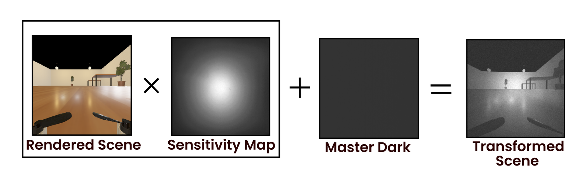
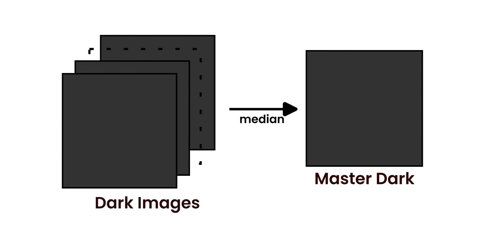
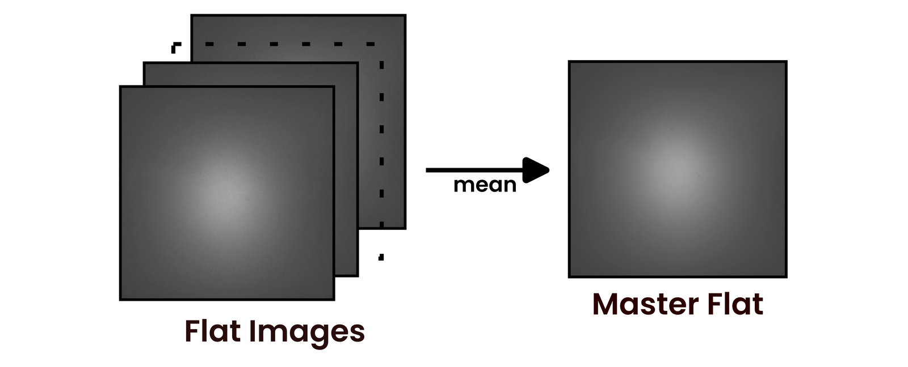
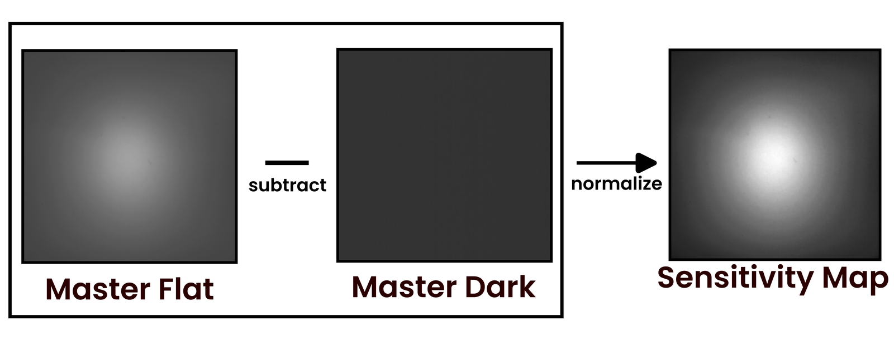

# RenderedToSensor

Transforms rendered images so they look like frames captured by a real grayscale camera sensor to limit the photometric sim-to-real gap in simulations. Each image goes through an optics stage (Gaussian blur, resample to correct size, then Brown-Conrady lens distortion) and then a photometric sensor stage that applies per-pixel fixed-pattern response measured from the camera itself by collected dark and flat images, adds shot/read/row noise. Output is written as an 8-bit PNG.

The photometric response comes from **a master dark and a sensitivity map** built from real dark and flat captures (dark = lens covered, flat = uniform illumination), rather than from synthetic noise parameters. The sensitivity map supplies the per-pixel gain and the master dark supplies the per-pixel offset. Nothing here is specific to one sensor: this is standard dark/flat photometric calibration and works for any camera you can capture dark and flat frames from.



Requires Python 3 with `numpy` and `Pillow` (`pip install numpy pillow`).

## Files

```
sensor_profile.json              the camera: geometry, distortion, noise, scale
transform_rendered_to_sensor.py  sensor model and single image transformation
batch_transform.py               the same model over a batch of images
make_masters.py                  capture stacks, then get master dark + sensitivity map
patch_dead_pixels.py             repairs persistent dead pixels, if necessary
examples/                        a worked run (see below)
```

Camera properties are in `sensor_profile.json`, so modelling a different sensor requires change in this file and its dark and flat image captures. Both transform scripts and `make_masters.py` read it.

## Quick start

```bash
# 1. build the master dark and sensitivity map from calibration captures (once per camera)
python make_masters.py \
  --dark-folder examples/darks --flat-folder examples/flats \
  --dark-output examples/master_dark --sensitivity-output examples/sensitivity_map

# 2. transform a render
python transform_rendered_to_sensor.py \
  --input examples/rendered.png --output out.png \
  --sensitivity-map examples/sensitivity_map.npy --master-dark examples/master_dark.npy

# or a whole folder
python batch_transform.py \
  --input-dir renders/ --output-dir out/ \
  --sensitivity-map examples/sensitivity_map.npy --master-dark examples/master_dark.npy
```

Master frames are the expected input. If you do not have them, synthetic fixed-pattern noise is available instead with the following:

```bash
python transform_rendered_to_sensor.py --input r.png --output o.png \
  --prnu-std 0.25 --dsnu-std 0.79
```

## How does it work?

The **calibration chain** runs once per camera and turns captured dark and flat stacks into two small maps. The **transform chain** runs per image and consumes `master_dark.npy` and `sensitivity_map.npy`.

### Calibration chain

**`patch_dead_pixels.py`** — *in:* one or more directories of 16-bit PNG captures. *out:* the same files, patched in place.

A pixel is only patched if it is an outlier in every directory passed, a defect appearing in only one is most likely not a sensor defect. Found defects are replaced by the mean of their  neighbours.

**`make_masters.py`** — *in:* the dark and flat directories, and the sensor profile. *out:* `master_dark.npy` and `sensitivity_map.npy`.

 `master_dark.npy` is an **additive offset in DN** and represents the sensor's measured intensity when there is no scene content (no photons reaching the sensor). `sensitivity_map.npy` is a **unitless multiplicative gain** that peaks at 1.0 — the sensor's per-pixel sensitivity. It is the master flat with the master dark subtracted, then normalized to the peak (the plain averaged flat is only an intermediate and is not saved).

The dark frames are combined by pixelwise median:



The flat frames are combined by pixelwise mean into the master flat, the intermediate averaged flat:



The master dark is subtracted from the master flat, and the result is normalized to its peak to give the sensitivity map:



### Transform chain

**`transform_rendered_to_sensor.py`** — *in:* a render image, a sensor profile, and the masters. *out:* one 8-bit PNG.

*Optics:* load the render as grey in 0-1, blur, scale to sensor's resolution, then apply  distortion.

*Sensor:* `convert_to_dn` scales to DN, then multiplies by the sensitivity map's gain, adds the dark's offset, applies Poisson shot noise, adds Gaussian read noise, which is per pixel, and row noise, then clips to scale.

`apply_sensitivity_map` multiplies each pixel by the gain value at the corresponding location in the sensitivity map.

**`batch_transform.py`** — *in:* a directory of renders. *out:* transformed PNGs with the same filenames. Does transformation on a directory of images.

## Examples

`examples/` contains the following:

- `darks/` — 25 dark frames, 16-bit grayscale.
- `flats/` — 25 flat frames, taken with a diffuser against a white screen.
- `master_dark.npy` / `sensitivity_map.npy` — built from those 50 frames.
- `rendered.png` and `transformed.png` — one frame before and after of the rendered simulation scene.
- `visuals/` — the pipeline diagrams shown above.

More images should be considered for better averaging.
